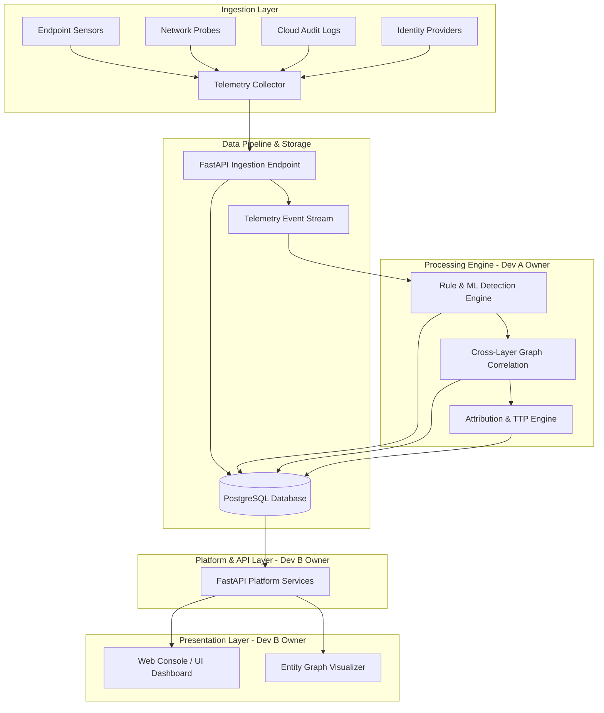

# System Architecture

## Overview

The Cross-Layer Threat Detection & Attribution Platform ingests telemetry events from multi-layer sensors (Endpoint, Network, Identity, Cloud), processes them through correlation and attribution engines, and exposes APIs and visualizations for security analysts.

## Module Ownership & Boundary Isolation

| Module | Responsible Role | Key Artifacts |
| :--- | :--- | :--- |
| Telemetry Schema & Contracts | Developer B (Platform) | `docs/EVENT_SCHEMA.md`, `docs/API_CONTRACT.md` |
| Database & ORM | Developer B (Platform) | `backend/app/models/`, `docs/DATABASE_SCHEMA.md` |
| REST API & Fixtures | Developer B (Platform) | `backend/app/api/`, `data/fixtures/` |
| Detection & Fusion Engine | Developer A (ML / Security) | `backend/app/services/detection/` |
| Attribution & TTP Engine | Developer A (ML / Security) | `backend/app/services/attribution/` |
| Presentation / Frontend UI | Developer B (Platform) | `frontend/` |
